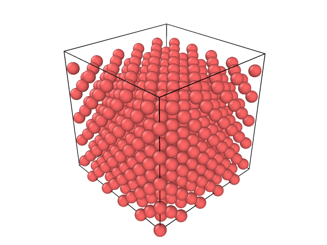

# PIS
Particle Interaction Simulator (PIS) is a rust repository for molecular dynamic(MD)simulation aspiring to be [LAMMPS](https://www.lammps.org/) like.

## A short intro to Molecular Dynamics
Material testing can be a very costly affair. Cue [Computational Material Science](https://tu-freiberg.de/en/study/master-computational-materials-science) which allows simulation of the material on computers. While this can be done on various scales, doing such simulations on the atomistic scale comes under the purview of [Molecular Dynamics](https://en.wikipedia.org/wiki/Molecular_dynamics).


<p style="text-align:center;">Fig.1</p>

Breifly speaking it involes generating an initial configuration of atoms (as shown in the Fig.1), calculating the forces on each atom based on the position of atoms in it's surrounding. Then we solve the Newtonian equations to generate the next positon of the atoms. This process is repeated to generate a simulation of the material as seen here:


<p style="text-align:center;">Fig.2</p>

## Potentials
In its current state, **PIS** implements the pair wise Lennard Jones potential. Several improvements have been added over this pair potential calculation like:
* Verlet neigbour list
* parallel computation. 
* SIMD acceleration

Because [nalgebra](https://docs.rs/nalgebra/latest/nalgebra/) is used to store postions, forces and velocities SIMD acceleration is built into the calculations.

The implementation of [MEAM potential](https://docs.lammps.org/pair_meam.html) is underway

## Examples
To trigger an example calculation run this command
```
./test_command.sh
```
An output `dump.lammpstrj` is generated which can be viewed in the [OVITO](https://www.ovito.org/) visulation software.

## How to run simulations
In its current state, PIS takes in a text file written in the lammps data file format.
```
cargo run --release --bin pis -- -i example/example.txt -T 5 --steps 100 --timestep 1
```
The input parameters have the following meanings
```
Options:
  -i, --infile <INFILE>            [default: data.txt]
  -s, --steps <STEPS>              [default: 50]
  -t, --timestep <TIMESTEP>        [default: 0.001]
  -T, --temperature <TEMPERATURE>  [default: 300]
  -d, --dump-path <DUMP_PATH>      [default: dump.lammpstrj]
  -h, --help                       Print help
  -V, --version                    Print version
```
